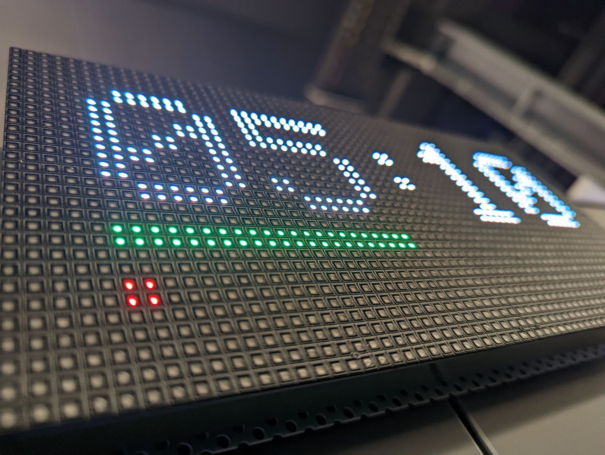
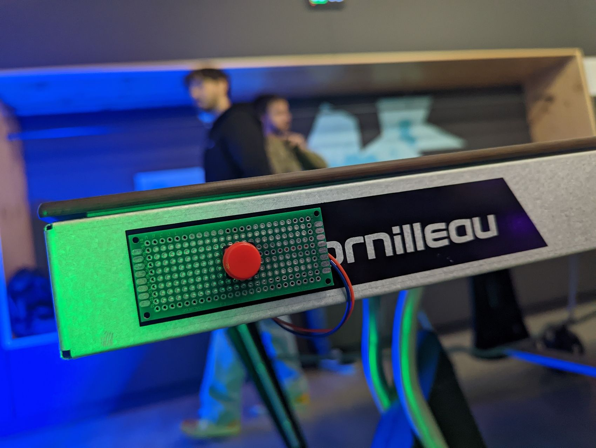

# Automated Ping-Pong Scoring System

  

## Team Members
- Gero Böhm
- Ole-Paul Heinzelmann
- Christian Meng
- Maria Travez

## Introduction
The Automated Ping-Pong Scoring System project is designed to modernize the scoring mechanism in ping-pong games by introducing an automatic, button-based scoring solution. Initially conceptualized to utilize ball recognition technology for score tracking, the project pivoted to a more feasible, button-based system to meet the ambitious goal of completion within 24 hours. This system employs ESP32 microcontrollers at its core, attached to buttons on each side of the table, allowing players to update the score with the simple press of a button. The score is then communicated to a central display, also powered by an ESP32, which manages the game logic and displays the current score.

## Objective
The primary objective of this project is to provide ping-pong enthusiasts with a reliable and easy-to-use automatic scoring system. By simplifying the scoring process, the system aims to enhance the gameplay experience, allowing players to focus more on the game and less on tracking scores manually. This project seeks to demonstrate the feasibility of integrating simple, yet effective, IoT solutions into recreational sports to improve accuracy and efficiency.

## System Overview
1. **Button Integration**: Each player is allocated a button, connected to an individual ESP32 microcontroller, placed conveniently on each side of the ping-pong table.
2. **Score Update Mechanism**: Players update their scores by pressing their respective buttons during the game, triggering a signal to the central display unit.
3. **Central Display Logic**: The ESP32 microcontroller within the display unit is programmed with the game logic, including score tracking, score display, and game state management (e.g., game start, end, and reset functionalities).
4. **Communication Protocol**: The ESP32 microcontrollers are configured to communicate with each other wirelessly, ensuring real-time score updates are accurately reflected on the display unit.

## Implementation Steps
1. Configuration of ESP32 microcontrollers to function with push buttons for score inputs.
2. Development of game logic within the ESP32 microcontroller at the display, including score incrementation, display updates, and game state controls.
3. Establishment of wireless communication protocols between the ESP32 units to ensure seamless score updates.
4. Integration of the system with a physical display to visually present the score to players and spectators.

## Technologies Used
- **Microcontroller**: ESP32 for handling input from buttons, wireless communication, and display control.
- **Programming Language**: C++/Arduino, utilized for programming the ESP32 microcontrollers.
- **Display Technology**: Integration with digital displays for real-time score visualization.

## Environment Setup
Guidelines are provided for setting up the ESP32 microcontrollers with the necessary software and connecting them to the push buttons and display unit. This includes steps for programming the ESP32 units, wiring instructions, and troubleshooting tips for common setup issues.

  

## Usage
Activating the Device
To wake the ESP32 from sleep mode, simply press the button. This action is required by each player at the beginning. As soon as the device exits sleep mode, the display will activate and start showing the score.

Managing Scores
- Scoring Points: For each point scored, press the button once. This increments the score displayed.
- Correcting Scores: In case of mistakenly added points, press and hold the button for 1 second to decrease the score by one. This allows for quick and easy score adjustments.
- Resetting the Game: If you need to start over or prepare the game for new players, press and hold the button for more than 3 seconds. This action will reset the entire game, clearing the score and allowing for a fresh start.
Game End and Reset
Once the game reaches its conclusion, it automatically resets, preparing itself for a new round. This feature ensures seamless transition between games, allowing players to enjoy continuous play without manual resets. Enjoy your gaming sessions with the ease of managing scores, game states, and automatic resets with just a few button presses.

## Results & Contributions
The project showcases a practical implementation of IoT technologies in enhancing recreational sports experiences. By successfully deploying a simplified, button-based scoring system, the project invites further innovation in automating and enhancing game management in sports. The team welcomes contributions from the community to refine the system, possibly including future enhancements such as direct ball recognition for fully automated scoring.

## Contact & Contributions
The project encourages feedback, suggestions, and contributions to improve the system's design and functionality. Interested contributors are invited to engage with the project, potentially expanding its capabilities or refining its existing features.

